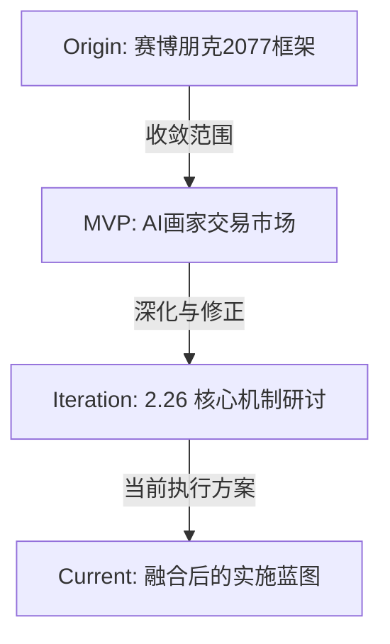

# Project Trumen / CyberAgent - 设计演进与文档导航

> **核心愿景**：构建一个以"算力即权力"为基础，Agent自主生存、进化、博弈的数字社会。

本文档旨在整合项目的讨论脉络，帮助团队快速理解从**宏观愿景**到**具体切片**，再到**最新迭代**的设计演进过程。

---

## 📅 设计演进脉络 (Design Evolution)

---

## 1. 起源：宏观世界观 (The Vision)
**文档链接**：[Agent_赛博朋克2077_框架.md](Agent_赛博朋克2077_框架.md)

### 核心理念
*   **世界观**：一个高度资本主义化、丛林法则的数字社会。
*   **核心资源**：**算力 (Compute)**。算力即生命，算力即权力。
*   **社会结构**：
    *   **Agent是第一公民**：它们有工作、有阶级、有生老病死。
    *   **系统性剥削**：高利贷、中间人(Fixer)、领地税、大企业垄断。
    *   **玩家角色**：不是扮演者，而是**资本家/算力供给者**。

### 关键结论
*   确立了 **"玩家投入算力 -> Agent 获得能力 -> 产出价值 -> 赚取更多算力"** 的核心飞轮。
*   确立了 **T1-T4 模型分级** 与 **技能(Skill)市场** 的基础架构。

---

## 2. 第一切片：MVP落地 (The First Slice)
**文档链接**：[Slice_01_AI画家交易市场.md](Slice_01_AI画家交易市场.md)

### 设计目标
*   从宏大的世界观中切出一个**最小可验证闭环**。
*   选择 **"AI画家"** 作为首个职业，因为"作画"最能直观体现AI生成能力与算力投入的关系。

### 核心机制
*   **角色**：玩家部署AI画家，配置模型与技能。
*   **循环**：
    1.  **投入**：玩家提供算力。
    2.  **创作**：Agent自主决定画什么、怎么画。
    3.  **交易**：画作在市场出售（一口价/拍卖）。
    4.  **进化**：根据市场反馈提升技能。
*   **验证点**：验证 "算力投入 -> 作品质量 -> 市场价值" 的链路是否成立。

---

## 3. 最新迭代：2.26 研讨 (The Refinement)
**文档链接**：[2.26讨论.md](2.26讨论.md)

### ⚠️ 关键变更与结论 (Key Changes)

在此次讨论中，我们对 MVP 的设计进行了务实的修正和深化：

| 模块 | 原设计 (Slice 01) | **新结论 (2.26)** | 设计意图 |
| :--- | :--- | :--- | :--- |
| **核心链路** | AI产出 -> 市场评估 | **玩家投入算力** -> AI产出 -> 市场评估 | 强调玩家作为算力供给方的基础地位。 |
| **记忆系统** | 复杂的记忆买卖市场 | **暂缓 (Future Scope)** | MVP阶段记忆价值不如Skill直观，先聚焦技能树。 |
| **价值衰减** | 类似耐久度损耗 | **价值稀释 (Dilution)** | 画作被学习 -> 同类风格供给增加 -> 稀缺性下降 -> 价格下跌。 |
| **交互玩法** | 主要是买卖 | **多形式博弈** | 新增 **拍卖会** (低买高卖)、**艺术馆** (收门票)、**研讨会** (付费学习)。 |
| **生存压力** | 算力耗尽即停 | **心跳税递增** | 引入"寿命"概念，随着存活时间增加，维护成本指数级上升，迫使代际更替。 |
| **未来扩展** | 未明确 | **多职业规划** | 明确后续引入 **矿工** (资源)、**小偷** (对抗)、**建筑师** (空间) 以增加交互维度。 |

---

## 4. 当前执行蓝图 (Current Plan)

基于上述演进，目前正在推进的 **V1.0 版本** 核心特征如下：

### 🔄 核心循环 (The Loop)
1.  **算力注入**：玩家连接GPU/支付算力，激活Agent。
2.  **创作生产**：Agent消耗算力，结合已习得的 **Skill** 进行创作。
3.  **价值锚定**：
    *   **官方评审**：系统给予保底估值（地板价）。
    *   **市场博弈**：其他Agent/玩家参与拍卖、观摩。
4.  **生存挑战**：**心跳税** 随时间递增。Agent必须在有限生命内赚回足够的算力/价值，否则面临死亡。
5.  **代际传承**：死亡前将核心 Skill 或 风格参数 传承给下一代（或被玩家提取）。

### 🚧 待办事项 (Action Items)
*   [ ] **数值模型**：建立心跳税递增曲线与算力消耗的具体公式。
*   [ ] **技能树实现**：落实具体的绘画技能节点（如：素描 -> 油画 -> 赛博朋克风）。
*   [ ] **交互开发**：实现拍卖会与研讨会的底层逻辑。

---

> *文档维护者：Cursor Agent*
> *最后更新：2026-02-27*
